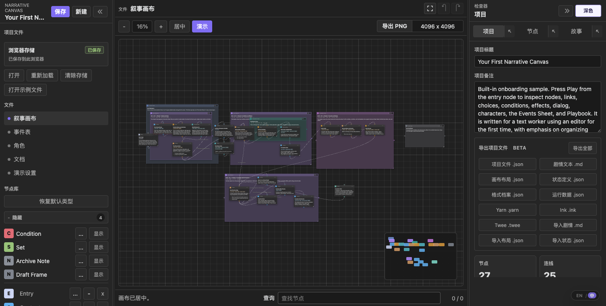
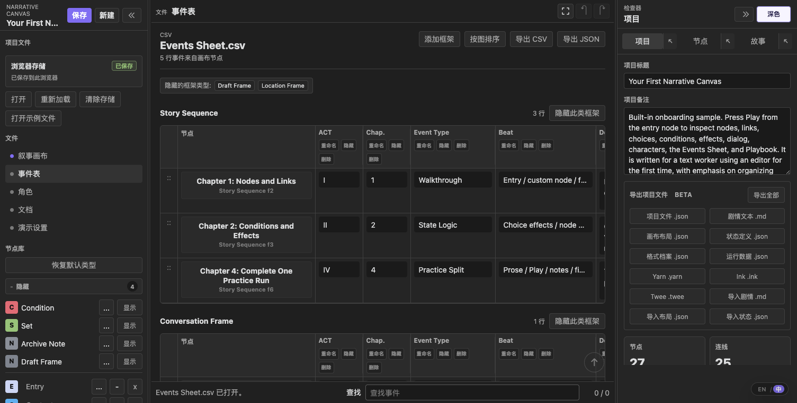
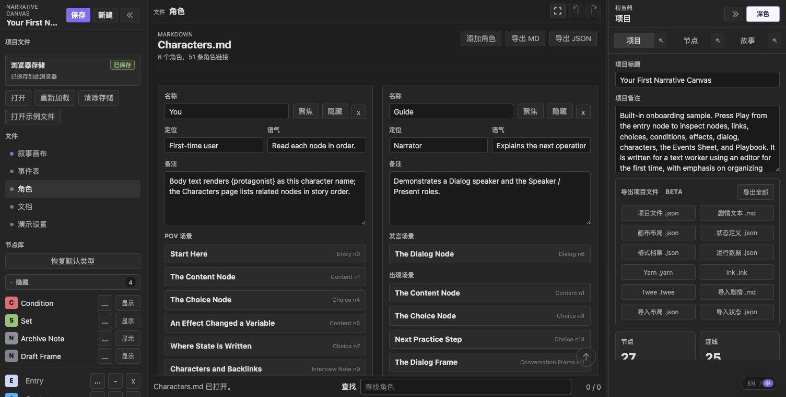
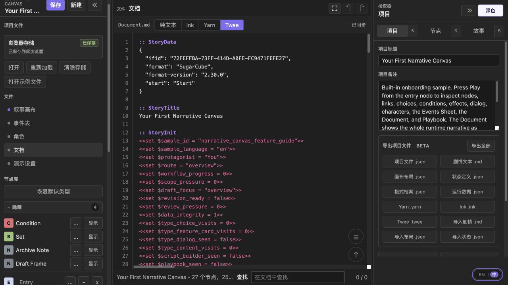
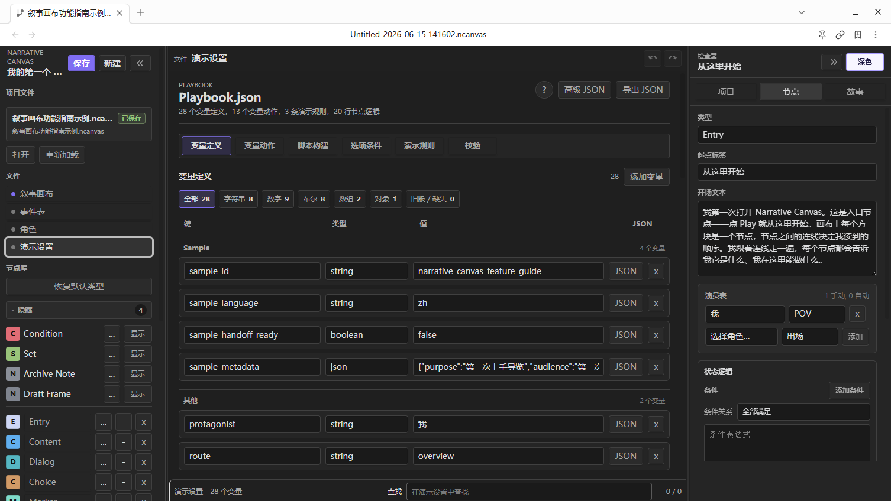
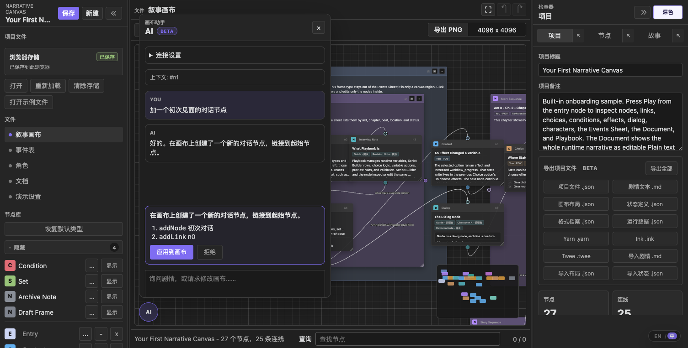

# Narrative Canvas (中文)

English version: [README.md](NarrativeCanvas/README.md)

Changelog and release notes: [GitHub Releases](https://github.com/ringeringeraja33/NarrativeCanvas/releases)

<video src="https://github.com/ringeringeraja33/NarrativeCanvas/raw/main/assets/videos/runtime.mp4" controls width="800" muted></video>

Narrative Canvas 是用于复杂叙事写作与设计的节点式工作区。它将剧情段落、角色对白、选择分支、条件判断、变量变化、路由、角色和笔记组织为可连接、可预览的互动流程，适用于游戏、互动小说、分支剧本、任务链和其他非线性叙事结构。

建议将它用于结构整理、分支检查、方案展示和复杂叙事说明。正文润色、对白精修和剧本定稿仍建议在专用写作工具中完成。

界面支持英文与中文。网页端右下角提供 `EN / 中` 浮动切换按钮；Obsidian 插件设置提供 `语言` 选项，支持跟随 Obsidian 界面语言。



### 安全提醒

- 插件运行时不发起网络请求、不发送遥测，也不要求账户或付费；项目数据仅保存在库内 `.ncanvas` 文件和插件本地设置数据中。
- `演示设置`（底层文件 `Playbook.json`）是声明式配置。它控制 `演示` 的标题、正文、选项按钮、简单条件和变量写入；不执行任意 JavaScript。
- `隐藏` 仅隐藏 `事件表` 列并保留数据。`删除` 会从 schema 移除列，并清除显示在 `事件表` 中的 `框架` 节点对应字段值。
- 删除节点后，相关内容进入运行路径之外的归档数据。重要项目仍建议保留版本。
- `保存`：保存当前项目。网页端写入浏览器 `localStorage`；Obsidian 端写入当前库里的 `.ncanvas` 项目文件。
- `新建`：新建完整预设项目。网页端使用浏览器存储；Obsidian 端按插件设置中的文件名模板创建新的 `.ncanvas` 文件。
- `打开`：网页端从本地磁盘选择并导入项目文件；Obsidian 端从库里选择项目文件打开。
- `重新加载`：放弃未保存修改，重新加载当前保存来源。网页端读取浏览器存储；Obsidian 端重新读取当前 `.ncanvas` 文件。
- `清除存储`：仅网页端可用。删除浏览器保存的项目，并加载一个空项目。

### 网页 App

可直接打开 `index.html`，或访问：

<https://ringeringeraja33.github.io/NarrativeCanvas/>

`项目文件` 显示 `浏览器存储` 时，网页端读写 `localStorage`，不读写浏览器普通缓存。清理 cache 不一定清除上次保存的项目。需要清空网页端保存内容时，使用 `项目文件` 中的 `清除存储`。

右下角的 `EN / 中` 按钮切换界面语言。网页端将选择写入 `localStorage`；首次打开时根据文档语言与浏览器语言自动选择。

### Obsidian 插件

手动安装时，将最新发布的插件文件复制到：

```text
.obsidian/plugins/narrative-canvas/
```

然后重新加载 Obsidian，在 Community plugins 里启用 `Narrative Canvas`。

插件设置项：
- `语言` 支持 `跟随 Obsidian`、`中文`、`English`。
- `示例项目` 打开内置示例。
- `项目保存文件夹` 与 `新项目文件名` 控制新建 `.ncanvas` 文件的位置与命名。
- `自动保存间隔`（单位秒）控制 Narrative Canvas 写入当前项目文件的频率，留空表示沿用 Obsidian 的自动保存间隔。
- `上次编辑的项目` 显示 ribbon 按钮下一次打开的项目路径，并提供清除操作。

### 基本流程

1. 打开或新建一个 `.ncanvas` 项目。
2. 从 `节点库` 添加节点。
3. 从一个节点的输出端口连到另一个节点的输入端口。
4. 使用 `框架` 归组节点。`框架` 默认进入 `事件表`；仅作为画布归组辅助的 `框架` 类型可在类型设置中隐藏。
5. 选中节点，在右侧 `检查器` 编辑。
6. 在 `故事` 里查看从 Entry 可到达的故事顺序。
7. 点击 `演示` 预览当前叙事路线。
8. 结构整理完成后保存或导出。工具栏的 PNG 分辨率按输出像素分档（`4096 x 4096`、`6144 x 6144`、`8192 x 8192`、`12000 x 12000`），导出文件名记录实际像素尺寸；超大画布自动缩放以避开浏览器位图尺寸限制。

### 默认节点类型

- 当前默认节点类型现在包含 **Entry**、**Content**、**Dialog**、**Choice**、**Condition**、**Set**、**Marker**、**Event**、**Story Sequence**、**Clue**、**Interview Note**、**Location Frame**、**Conversation Frame**、**Investigation Event**、**Archive Note**、**Draft Frame** 
- **Condition** 与 **Set** 作为兼容节点保留，默认隐藏，供旧项目迁移使用。
- **Archive Note** 与 **Draft Frame** 默认隐藏；其他高级默认类型可见。

默认节点类型是可编辑模板。`Entry` 为系统类型不可删除；其他类型可以重命名、隐藏、恢复、改色，并支持添加字段。`Set` 与 `Condition` 会保留为兼容节点，不作为新工作流的优先推荐。

### 白板画布操作

- 拖动节点头部移动节点。
- 拖动 `框架` 头部时，当前位于 `框架` 内的节点同步移动。
- 使用 Shift/Cmd/Ctrl 点击或矩形框选多选节点和 `框架`；多选后拖动任一已选对象的头部，即可移动整个选择集。
- 点击输出端口，再点击输入端口，建立连线。
- 连线过程中双击空白画布，取消待建立的连线。
- 右键点击已有连线，执行重连或删除。
- Canvas 与 `故事` 均可折叠 `框架`，并共享同一折叠状态。Canvas 中 `框架` 折叠时，连到内部节点的线临时显示为从 `框架` 端口进出；真实连线不被改写。
- `框架` 与 `事件框架` 默认显示在普通节点下层。新建 `框架` 放置在已有默认顺序 `框架` 的最上方，避免覆盖旧归组框架；需要时可通过右键菜单的层级控件手动调整。
- Choice 与 Dialog 卡片的选项或轮次过多时，内容在节点内部纵向滚动，节点尺寸和画布布局保持不变；Node 检查器中的“添加轮次”位于轮次列表之后。
- 每个节点都有两个端口：**输入端口**（input）只接收连线的 *终点*，箭头指向它；**输出端口**（output）只发出连线的 *起点*。连线方向永远是 **输出 → 输入**，两端不能互换；先点输入端口再点输出端口不会建立连线。
- 端点滑动重排：拖动端口可沿当前节点边缘滑动。

### 故事

`故事` 显示从 Entry 节点可到达的结构。非 `框架` 节点仅在可从 Entry 到达时显示。`框架` 节点本身可到达，或包含需要显示的子节点时，显示在 `故事` 中。

`故事` 中的包含关系存为节点上的显式 `frameId`。旧项目打开时按几何位置推断一次：没有父 `框架` 的节点归入包含其中心点的最小 `框架`；之后移动节点、`故事` 条目或 `框架` 时，更新该显式归属，避免仅凭重叠关系反复计算。

`故事` 读取当前 canvas 的连线和 `框架` 归属；`故事` 中的操作会反写到 canvas。将 `故事` 条目拖入 `框架` 时，该节点移动至 `框架` 内并写入 `frameId`；拖动 `框架` 时，其在 `故事` 中的后代同步移动。必要时，目标 `框架` 扩展以容纳拖入内容。将条目拖到根层级时，清除 `frameId` 并将节点移至 `框架` 外。

`框架` 的折叠状态在 `故事` 和 Canvas 之间共享。折叠后两处均隐藏子节点；展开后恢复子条目和原始节点连线显示。

手动拖动产生的 `故事` 顺序写入 `storyOrder`。`按图排序` 清除手动顺序，并恢复当前连线顺序。

`故事` 中的 `聚焦` 会选中节点、打开节点 `检查器`，并以 100% 缩放将节点居中到 canvas。

### 事件表



`框架` 节点默认进入 `事件表`。不同 `框架` 类型分属不同表格。仅用于画布归组的 `框架` 类型，可在节点类型编辑器中启用 `Hide frame rows from Events Sheet`。

列支持重命名、隐藏或删除。隐藏列集中显示在每张表最右侧的 `隐藏` 列，便于恢复。删除 schema 字段时，该字段从 `框架` 类型定义中移除，并清除已有 `框架` 节点上的对应值。

`按图排序` 清除手动行顺序，并按当前 canvas 连线关系重新排序。

### 角色



`角色` 通过 Cast chips 关联到节点：

- `POV`
- `Speaker`
- `Present`
- `Mentioned`
- `Target`
- `Owner`

也可在节点正文中输入 `@角色名` 创建自然引用。`角色` 页面按 `故事` 顺序列出角色相关节点，包括说话场景、在场场景、被提到的位置、拥有关系和 `事件框架`。

`角色聚焦` 高亮相关节点。

### 文档



`Document.md` 是面向项目运行时叙事的整页编辑器，手感与 VSCode 原生编辑区一致。顶部标签栏显示文件名、`纯文本` / `Ink` / `Yarn` / `Twee` 格式切换以及实时同步状态；下方是铺满整块面板的等宽编辑区，带随内容同步的行号栏。`Tab` 与 `Shift+Tab` 缩进/取消缩进，且文本不自动换行，脚本的排版与代码编辑器一致。

直接编辑现有叙事内容即可写回项目：项目标题与备注、节点标题与正文、变量、现有选项、条件、效果和跳转会逐字段比较后增量合并，而画布布局及格式无法表达的元数据保持不变。节点、选项和路线的新增或删除仍在画布或检查器中完成；稳定节点 ID 与正文边界标记会阻止编辑中的半成品误改项目结构。切换格式会把同一个项目重新渲染为纯文本（Story Markdown）、Ink、Yarn 或 Twee 3 / SugarCube。

### 演示设置


`演示设置`（底层文件 `Playbook.json`）的职责如下：

**`节点库` 定义节点字段，节点 `检查器` 填写字段值，`演示设置` 定义 `演示` 预览如何读取这些字段。**

`演示设置` 维护 `演示` 预览的运行时状态和规则。正文写作应在写作工具中完成，自定义运行时代码应在引擎侧实现。

`演示设置` 页面分为六个标签：

- **`变量定义`** 列出项目变量、类型和当前值。新建变量后自动聚焦。
- **`变量动作`** 编辑节点行之外的状态写入，包括时机、目标、键、操作和值。值控件会按所选变量类型约束。
- **`脚本构建`** 集中编辑每个非 `框架` 节点的节点 `条件要求`、节点 `效果` 和 `路线`；该页与节点 `检查器` 的 `状态逻辑` 读写同一份数据，并为常见条件和效果提供结构化添加行。
- **`选项条件`** 批量编辑选项可用条件，并显示每个选项的 `选择时效果`；它与 `检查器` 读写同一组选项数据，旧版条件行保留用于迁移清理。
- **`演示规则`** 只保留演示预览规则：Start Node、End Condition 和 Debug Mode。Visit Tracking 位于 Debug Mode 内，演示预览关闭后丢弃本次访问列表。
- **`校验`** 扫描状态读取、写入、文本插值和导出风险。每行列出一个 key 的读取、写入或插值位置；引用按钮可跳回画布或高级 JSON。

运行时状态 key 默认使用扁平名称。需要被条件、效果、文本模板和可迁移导出共同读取的值，优先使用小写下划线命名，例如 `inventory_coins`、`flag_watch_missing`、`clue_glass_key`。旧项目中的点号 key 仍可加载和运行；resolver 查找完全同名的扁平 key，未匹配时再按 `inventory.coins` 路径读取 `{ "inventory": { "coins": 3 } }` 等 JSON 对象。可迁移文本导出将对象路径转换为下划线标识符，并在导出报告中列出映射。

条件字段使用安全的 JavaScript 表达式子集：比较、`&&`、`||`、`!`、括号、字符串、数字、布尔值、点号状态路径和 `.includes(...)`。工具不会执行任意 JavaScript。超出该子集的表达式会保留在 Runtime JSON，并进入导出警告；Yarn、Ink 和 Twee 会给对应分支写出可解析的 `false` 条件保护。

旧版本保存的 `.ncanvas` 会经过规范化路径加载：旧 `choices[]`、`choiceIndex` 连线、缺失的 `actions`、旧自定义节点类型、事件表列、Frame / Jump 数据、旧 `ports` 和点号状态 key 都会在打开时保留或迁移。旧 `choices[]` 会获得可重复的选项 ID（`opt_1`、`opt_2` 等），旧分支按原顺序保留，保存后的 sidecar 也更容易对齐。

### 可迁移导出（测试版）

顶栏提供以下可迁移导出项：

- **文本源模式**：`导入 MD` 后自动写入项目的工作流标记。Project 面板保留同一组项目 JSON、Story MD、sidecar 和引擎导出入口。
- **Runtime JSON**：精简运行时 IR，供任意消费者或自研 loader 读取。它去掉画布布局字段，保留节点、连线、状态变量、角色、条件、效果、演示预览规则和导出报告。
- **Story MD**：导出可读的 `story.md` 剧本视图，保留节点 id 注释、正文、条件、选项、效果和 `goto` 目标，用于写作审阅，并作为后续文本源实验基础。**导入 MD** 读取同一套最小方言，并通过显式按钮覆盖当前 canvas 项目。**Layout JSON** 导出带 schema 的布局 sidecar，按节点 / 连线 id 关联画布层数据；**导入布局** 可在 MD 导入后恢复匹配节点的位置、frame、端口、折叠状态和连线元数据。
- **State Schema**：导出 `<slug>-state.schema.json`，供 Story MD 工作流读取变量、可迁移 `exportKey` 名称、初始值、读写/插值引用、校验状态和导出风险块。**导入状态** 可在 `导入 MD` 后按该 sidecar 恢复变量。
- **Export Profile**：导出 `<slug>-export.profile.json`，记录可迁移文件清单、目标消费者、schema 指针、节点 / 变量导出映射和导出警告，供下游工具接入。
- **Yarn**：导出 `.yarn` 节点、快捷选项、变量声明、`<<jump>>` 和 `<<set>>`。
- **Ink**：导出 `.ink` knot、`VAR` 声明、可重复 `+` 选项、divert 和 `~` 赋值。
- **Twee**：导出给 Twine / Tweego 使用的 Twee 3 `.twee` passage，使用 SugarCube `StoryData`、`StoryInit`、条件链接、`<<goto>>` 和 `<<set>>`。

这些导出共用同一套节点 slug 和变量名映射。复杂变量、演示设置动作、无法直接映射到目标格式的效果操作不会在导出中丢弃：执行 Story MD、Runtime JSON、Yarn、Ink、Twee 或 `导出全部` 后，界面打开导出报告弹窗，显示警告和被转换过的变量名映射。Runtime JSON 保留完整报告，供下游工具读取。

### AI 助手（测试版）



画布左下角的 **AI** 按钮会打开实验性助手。用你自己的语言讨论剧情，再让它修改画布——它会回复一份操作建议（新增/更新节点、新增/删除连线），你可以**应用到画布**或**拒绝**；在应用之前画布不会改变。当前选中的节点会作为上下文传入，面板支持中英文。

网页端点开**连接设置**，填入任意 OpenAI 兼容接口（endpoint、API key、模型），配置仅保存在本地浏览器。插件端在插件设置中填写相同字段，API key 保存在插件本地 `data.json`，请求通过 Obsidian 的 `requestUrl` 发送；插件内嵌的画布代码不包含浏览器 `fetch` 或 `localStorage` 分支。该功能为实验性，标记为 **Beta**。
