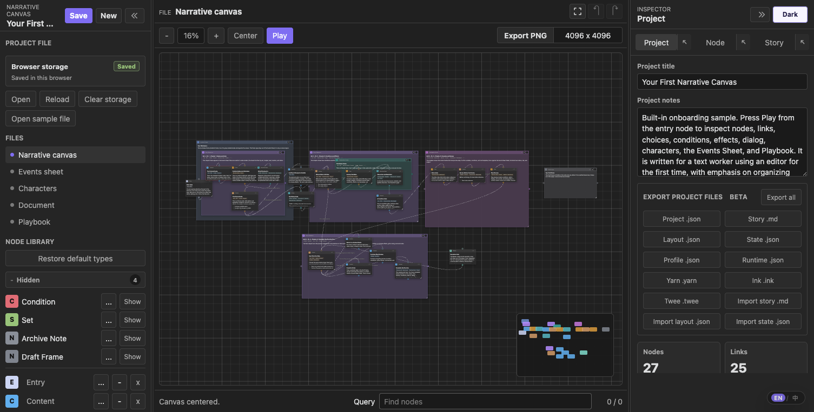
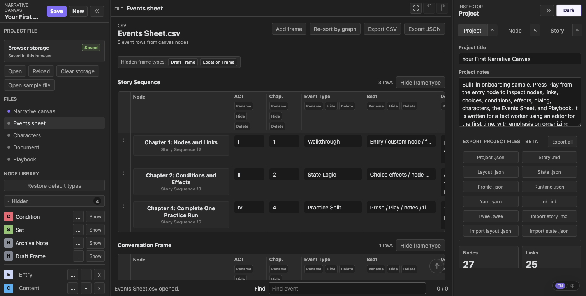
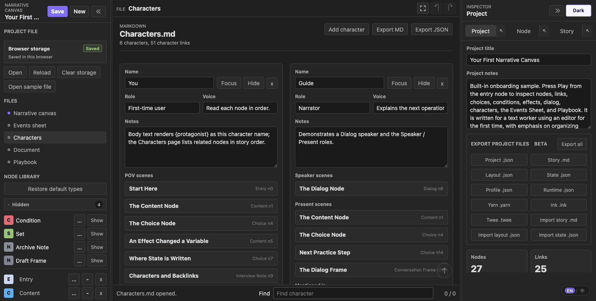
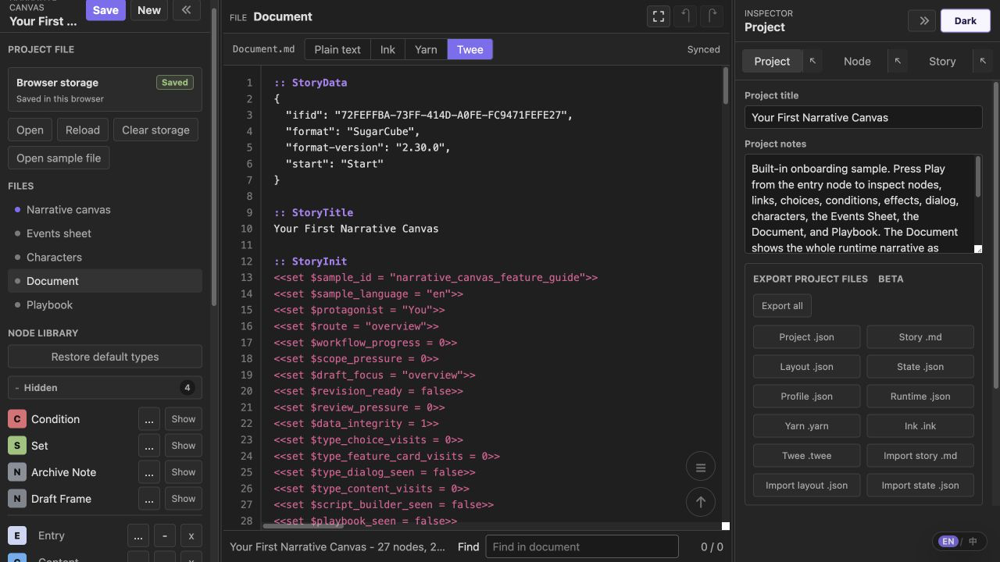
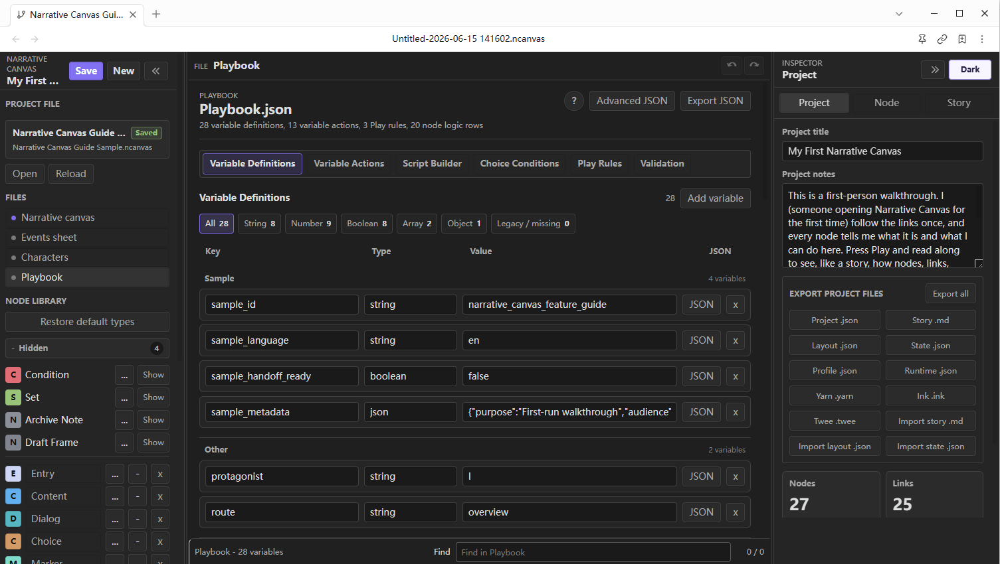
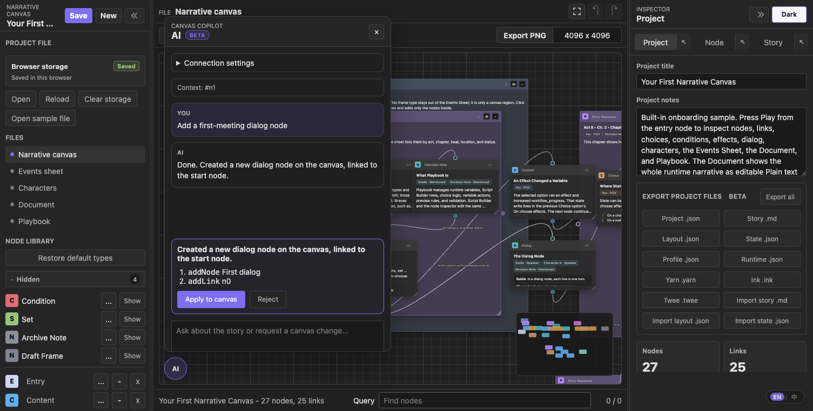

# Narrative Canvas

[](https://github.com/ringeringeraja33/NarrativeCanvas/actions/workflows/plugin-artifacts.yml?query=branch%3Amain)

Current release: [1.3.0](https://github.com/ringeringeraja33/NarrativeCanvas/releases/tag/1.3.0) · [All releases](https://github.com/ringeringeraja33/NarrativeCanvas/releases)

Obsidian Community Plugins: [Narrative Canvas](https://community.obsidian.md/plugins/narrative-canvas)

[中文版本](https://github.com/ringeringeraja33/NarrativeCanvas/blob/main/README-zh.md)

<video src="https://github.com/ringeringeraja33/NarrativeCanvas/raw/main/assets/videos/runtime.mp4" controls width="800" muted></video>

Narrative Canvas is a node-based workspace for building complex interactive narratives. It unifies beats, dialogue, branching choices, conditions, variable updates, routing, cast and notes into a single connected structure that can be previewed and edited directly.

It is intended for structure planning, branch validation, pitch preparation, and narrative explanation. Keep prose drafting, text polishing, and dialogue writing in your preferred writing tool.

The interface supports both English and Chinese. The web app has an `EN / 中` floating language switch, and the Obsidian plugin has a `Language` setting that can follow Obsidian’s language.



## Safety Notes

- The plugin core makes no network requests, sends no telemetry, and requires no account or payment. Project data stays in vault `.ncanvas` files and the plugin's local settings data. The optional AI copilot sends requests only to the OpenAI-compatible endpoint you configure in plugin settings.
- `Playbook.json` is declarative. It defines `Play` titles, body text, choice options, condition syntax, and variable writes, and does not execute arbitrary JavaScript.
- `Hide` only hides Events Sheet columns; it does not delete data. `Delete` removes a schema field and also clears matching values from frame nodes in the Events Sheet.
- Deleted nodes are moved to an archive outside the runtime path for recovery safety, but you should still version important projects.
- `Save`: saves the current project. In the web app, it writes to browser `localStorage`. In Obsidian, it writes the active `.ncanvas` file in your vault.
- `New`: creates a fresh project. In the web app, this uses browser storage. In Obsidian, it creates a `.ncanvas` file according to plugin settings.
- `Open`: in the web app, imports a project file from disk; in Obsidian, opens a project file from the vault.
- `Reload`: discards unsaved changes and reloads the last saved source. In the web app, this reads browser storage; in Obsidian, it rereads the active `.ncanvas` file.
- `Clear storage`: web app only. Removes the browser-stored project and opens an empty project.

### Web App

Open `index.html` directly, or visit:

<https://ringeringeraja33.github.io/NarrativeCanvas/>

When the Project File control shows `Browser storage`, the web app reads and writes `localStorage` (not browser HTTP cache). If you clear browser cache, the saved project file may still remain. Use `Clear storage` if you want a full local reset.

The floating `EN / 中` button switches language. The web app stores your last choice in `localStorage`; on first load it auto-selects based on document and browser locale.

### Obsidian Plugin

For manual installation, copy the latest released plugin files into:

```text
.obsidian/plugins/narrative-canvas/
```

Then reload Obsidian and enable `Narrative Canvas` under Community plugins.

Plugin settings:

- `Language` options: `Follow Obsidian`, `中文`, and `English`.
- `Sample project` opens the bundled sample project.
- `New project root folder` and `New project file name` control the project location and naming. Each new project gets its own folder containing the `.ncanvas` file and a `Library` folder. Existing projects that already use `Codex/` keep that folder for compatibility.
- `Auto-save interval` (seconds) sets how often Narrative Canvas writes the active project file. Empty means Obsidian’s own autosave behavior applies.
- `Current project` shows the path that the ribbon button will open next, with a clear action.

The ribbon button adapts to the vault: with several `.ncanvas` projects it opens a project picker, with exactly one it opens that project directly, and with none it creates a new default project.

Canvas editing, navigation, zoom, search, preview, and node-creation commands are available under `Settings → Hotkeys`. The plugin does not assign default key combinations, so each command can be bound without overriding existing vault shortcuts.

### Main Workflow

1. Open or create a `.ncanvas` project.
2. Add nodes from the Node Library.
3. Connect one node’s output port to another node’s input port.
4. Use frames to group nodes. Frames are shown in Events Sheet by default; frame-only types can be hidden there via node type settings.
5. Select a node and edit it in the Inspector.
6. Use `Story` to inspect the reachable graph from `Entry`.
7. Click `Play` to preview the current narrative path. The preview keeps a scrollable log of the cards you just passed — scroll up to reread recent story, limited to the last 30 cards, and use `Return to this card` on a past card to rewind the story to that step.
8. Save or export when structure is ready. PNG export presets are `4096 x 4096`, `6144 x 6144`, `8192 x 8192`, and `12000 x 12000`, and filenames include the final rendered size. Very large canvases are auto-scaled to stay within browser raster limits.

### Default Node Types

- The current default node types are: **Entry**, **Content**, **Dialog**, **Choice**, **Marker**, **Event**, **Story Sequence**, **Clue**, **Interview Note**, **Location Frame**, **Conversation Frame**, **Investigation Event**, **Archive Note**, and **Draft Frame**.
- **Archive Note** and **Draft Frame** are hidden by default; other advanced defaults are visible.

Default node types are editable templates. `Entry` is a system type and cannot be deleted. Other types can be renamed, hidden, restored, recolored, and extended with custom fields. State checks and writes use node requirements, link or choice conditions, and effects.

### Canvas Operations

- Drag a node by its header to move it.
- Drag a frame by its header to move all nodes inside it.
- Use Shift/Cmd/Ctrl + click or rectangle select for multi-select, then drag a selected header to move the group.
- Click an output port then an input port to create a link.
- Double-click empty canvas space to cancel a pending connection.
- Right-click an existing link to reconnect or delete it.
- `Canvas` and `Story` can both collapse frames, with shared collapse state. When collapsed in Canvas, links to child nodes are routed through frame ports temporarily; underlying links are not rewritten.
- `Frame` and `Event Frame` are rendered below normal nodes by default. New frames are inserted above existing frame layers; frame depth can be adjusted via the node context menu.
- Choice and Dialog cards keep long option or turn lists inside a vertically scrollable preview, so node size and canvas layout stay unchanged. In the Node inspector, `Add turn` appears after the turn list.
- Every node has two ports: an **input port** (`input`) that receives links, and an **output port** (`output`) that starts links. Flow is always output → input, and input-to-output clicks are ignored. A `Focus` action selects and centers that node at 100% zoom.
- Ports can be repositioned by dragging along a node boundary. Port positions are saved on the node and persist across sessions.

### Story

`Story` shows the reachable structure from `Entry`. Non-frame nodes appear only if reachable from `Entry`. Frame nodes appear when the frame itself is reachable, or when it contains reachable descendants.

Story membership is stored explicitly as `frameId` on each node. On opening older projects, membership is initially inferred from canvas geometry: ungrouped nodes are assigned to the smallest frame containing their center. After that, moving nodes, Story rows, or frames updates explicit membership instead of recomputing overlap continuously.

Story updates read from current canvas links and frame membership, then write back to the canvas. Dragging a Story row into a frame assigns its node to that frame and writes `frameId`. If the dragged row is a frame, descendants move together. The target frame may expand to include incoming nodes. Dragging a row to root level clears `frameId` and removes it from frames.

Frame collapse state is shared between Story and Canvas. Collapsing a frame hides descendants in both views; expanding restores child rows and node-to-node link rendering.

Manual Story order is stored in `storyOrder`. `Re-sort by graph` clears manual ordering and restores graph-based order.

`Focus` in Story selects the node, opens the Node Inspector, centers it on canvas, and zooms to 100%.

### Events Sheet



`Frame` nodes appear in Events Sheet by default. Different frame types are placed in separate tables. Frame types used only for canvas grouping can enable `Hide frame rows from Events Sheet` in the node type editor.

You can rename, hide, or delete columns. Hidden columns are collected in each table’s rightmost `Hidden` column for recovery. Deleting schema fields removes them from frame-type definitions and clears matching values from existing frame nodes.

`Re-sort by graph` clears manual row order and sorts rows by current canvas graph position.

### Narrative Library



`Narrative Library` contains Characters, Locations, Items, and Lore. A node's `Library references` section can link any entry and store an appropriate relation: Character references include `POV`, `Speaker`, and `Present`; Locations use `Setting`; Items use `Featured` or `Used`; Lore uses `Referenced` or `Revealed`. Entry pickers are comboboxes: click or focus to browse the category-grouped menu, or type to search by name. Drag the handle beside a reference to reorder it, or focus the handle and press the Up/Down arrow key.

The Narrative Library overview uses compact masonry cards that automatically add columns as the panel grows. A single filtered result keeps the same compact card width instead of expanding into a full form. Select a card to edit the complete entry on its detail page. The detail page uses two columns: the entry's fields on the left and its `Referenced nodes` on the right, so backlinks stay visible while editing.

Every entry supports custom fields. Add, rename, or remove key–value pairs under `Custom fields`; in the plugin they round-trip as plain frontmatter keys in the entry's managed Markdown file, so fields added in either place stay in sync. Frontmatter keys the plugin does not manage are read back as custom fields.

Each category also has a `Category fields` template, edited from that category's tab on the overview. Template keys are prefilled on new entries and merged into existing entries of the category; removing a template key keeps entry values. The Library tab remembers the last-opened entry detail across file switches — re-click the tab to return to the overview, where focused entries carry a highlight badge.

Beyond the four built-in categories, the `+` button beside the category tabs creates **custom categories**; an empty custom category can be removed from its tab. Custom names round-trip through the markdown `category` frontmatter, so a category typed straight into a note appears in the Library automatically.

Entries can carry an **icon** image, shown on overview covers, the detail header, and the cast chips on canvas nodes. Overview covers pick, in order: the icon, a scaled snapshot of the entry's canvas board, the preview-image board layout, or a category placeholder.

In the plugin, `Create board` turns an entry's images and linked files into a real Obsidian `.canvas` board: the file is embedded at the end of the entry's note, previewed read-only in the detail page (click to open; it refreshes when the `.canvas` changes), and `Detach board` reverts to the image/file sections. In the focused vision board, images can be dragged, resized from the corner grip, and layered via the right-click menu. Icons, linked vault files, and canvas boards are Obsidian-only; the standalone web app keeps the categories, fields, tags, and preview images.

Type `@` in node text to search every library category. Selecting a suggestion creates an explicit ID-based reference, while the visible text remains readable. Category labels disambiguate names shared by different entries. Library entries show their node backlinks in story order.

Each backlink relation is an independent collapsible section. Its header shows the relation and matching node count; expanding it reveals the ordered node list.

Tags use removable tokens. Press Enter or type a comma to confirm a tag, use Backspace on an empty input to remove the last tag, or choose an existing tag from the suggestion menu.

In the plugin, each managed library Markdown file stores its ID, name, category, category-specific fields, tags, notes, visibility, and preview-image board in frontmatter. The Markdown body remains available for free-form material and is preserved during synchronization. Older managed files that stored notes in the body are migrated on their next save.

Library entries can reference multiple preview images. The detail page shows them in a compact embedded vision board; `Focus` opens a larger board where images can be repositioned, opened in the vault, or removed. Choose existing vault images without moving them, or import local files into the project's `Library` using the vault attachment-folder setting as a relative subfolder. Image files linked in Node Inspector use the same embedded and focused board.

Use library focus to highlight related nodes. Dialog Speaker fields remain Character-only.

In the plugin, a node's `Vault file` section can link multiple notes or other vault files. Each reference can be opened, removed, and previewed as Markdown on the canvas independently, and the ordered list can be rearranged by dragging the handle beside each row or with the handle's Up/Down arrow keys. Image files preview as images with an inline size slider on the card row. You can also **drag a file from Obsidian's file explorer onto a node card or onto the Vault file section** to link it. Existing single-file links migrate automatically when loaded.

### Edit document



`Edit document` sits directly below the canvas in the file list. It is a full-page, VSCode-style editor for the project's runtime narrative. A slim tab strip shows the file name, a `Plain text` / `Ink` / `Yarn` / `Twee` format switch, and the live sync status; below it an edge-to-edge monospace editor with a synced line-number gutter fills the whole pane. `Tab` and `Shift+Tab` indent and outdent, and lines do not soft-wrap, so scripts read the same as in a code editor.

Edit existing narrative content directly and changes sync back to the project: project title and notes, node titles and bodies, variables, existing choices, conditions, effects, and routes are compared field by field before they are merged. Canvas layout and metadata the format cannot express stay unchanged. Add or delete nodes, choices, and routes on the canvas or in the inspector; stable node IDs and body-boundary markers keep incomplete source edits from changing structure. Switching formats re-renders the same project as Plain text (Story Markdown), Ink, Yarn, or Twee 3 / SugarCube.

### Playbook



Think of `Playbook.json` in this way:

**`Node Library` defines the fields each node type has. `Node Inspector` fills those fields. `Playbook` defines how Play preview reads and uses them.**

Use Playbook to configure Play runtime state and rules. Keep manuscript writing in your writing tool and runtime logic in your engine project.

Playbook has six tabs:

- **Variable Definitions** lists project variables with types and current values. New variables auto-focus.
- **Variable Actions** edits state changes outside node rows, including timing, target, key, operation, and value. The value control is constrained by variable type.
- **Script Builder** batch-edits non-frame node `Requirements`, `effects`, and `Routing`. It uses the same State Logic data as Inspector and provides structured row entry for common patterns.
- **Choice Conditions** batch-edits choice availability rules and displays each option’s `on-choose Effects`. It shares option data with Inspector and keeps legacy condition rows for migration consistency.
- **Play rules** controls preview behavior only: Start Node, End Condition, and Debug Mode. Visit Tracking is under Debug Mode, and its visit list is discarded when Play preview ends.
- **Validation** checks state reads/writes, text interpolation, and export risks. Each entry points to where a key is read, written, or interpolated, with links back to canvas or Advanced JSON.

Runtime state keys are flat names by default. For values shared across requirements, effects, text templates, and portable exports, prefer underscore keys like `inventory_coins`, `flag_watch_missing`, and `clue_glass_key`. Dot keys from older projects are still loadable: resolution checks flat keys first, then falls back to object paths like `inventory.coins`. Portable text exports flatten object paths and include key mappings in the export report.

Condition fields use a safe JavaScript expression subset: comparisons, `&&`, `||`, `!`, parentheses, quoted strings, numbers, booleans, dotted state paths, and `.includes(...)`. Arbitrary JavaScript is not executed. Expressions outside this subset stay in Runtime JSON with an export warning; Yarn, Ink, and Twee receive a parseable `false` guard for that branch.

Projects saved in older versions continue to load through normalization: legacy `choices[]`, `choiceIndex` links, missing `actions`, old custom node types, Events Sheet columns, Frame / Jump data, legacy `ports`, and dotted state keys are preserved or migrated. Legacy `choices[]` receive stable IDs (`opt_1`, `opt_2`, ...), so older branches keep order and sidecar output remains aligned after save.

### Portable Exports (Beta)

The top toolbar supports these export types:

- **Text Source Mode**: after `Import MD`, this mode flag is written automatically. Project file control remains unified across project JSON, Story MD, sidecars, and engine exports.
- **Runtime JSON**: a stripped runtime IR for external tools or custom loaders. It removes canvas layout fields while keeping nodes, links, state variables, ordered library references, the compatibility Character list, conditions, effects, play rules, and report output.
- **Story MD**: exports a readable `story.md` draft of the runtime graph including node IDs (in comments), body, conditions, choices, effects, and `goto` targets. It is used for review and text-first exploration. **Import MD** reads this format back into a canvas project and intentionally replaces the current project via explicit action.
- **Layout JSON** exports a schema-sidecar keyed by node/link IDs for canvas-only layout data. **Import Layout** restores positions, frames, ports, collapsed states, and link metadata after Story MD import.
- **State Schema**: exports `<slug>-state.schema.json` for Story MD workflows, including variables, portable `exportKey` names, initial values, read/write/template references, validation status, and export warning blocks. **Import State** restores variables from this sidecar after `Import MD`.
- **Export Profile**: exports `<slug>-export.profile.json`, listing portable files, target consumers, schema pointers, node/variable mapping, and export warning blocks for downstream handoff.
- **Yarn**: exports `.yarn` nodes, shortcut options, variable declarations, `<<jump>>`, and `<<set>>` commands.
- **Ink**: exports `.ink` knots, `VAR` declarations, sticky `+` choices, diverts, and `~` assignments.
- **Twee**: exports Twee 3 `.twee` passages for Twine / Tweego, including SugarCube `StoryData`, `StoryInit`, conditional links, `<<goto>>`, and `<<set>>`.

All exporters share one mapping of node slugs and variable names. Complex variables, Playbook actions, and effect operations that do not map cleanly to target formats are retained in Runtime JSON and exported as comments with warnings. After Story MD, Runtime JSON, Yarn, Ink, Twee, or Export All, an export report dialog appears with warnings and renamed variable mappings. Runtime JSON retains the full report for downstream tools.

### AI copilot (Beta)



The **AI** button at the bottom-left of the canvas opens an experimental copilot. Discuss the story in your own language, then ask it to change the canvas — it replies with a proposal of operations (add / update nodes, add / remove links) that you **Apply to canvas** or **Reject**. Nothing changes until you apply. The current node selection is passed as context, and the panel is bilingual. Messages render Markdown, support text, and can be copied individually or as a full conversation. Press Enter to send and Shift+Enter to insert a new line. The window can be dragged, resized, and pinned; reopening it from the AI button restores its default position and size.

In the web app, open **Connection settings** and point it at any OpenAI-compatible endpoint (endpoint URL, API key, model); that config is stored only in your browser. In the Obsidian plugin, configure the same fields in plugin settings; the API key is stored in the plugin's local `data.json`, and requests use Obsidian's `requestUrl`. The feature is experimental and marked **Beta**.

Any OpenAI-compatible provider works. For example, Google **Gemini** exposes an OpenAI-compatible endpoint — use `https://generativelanguage.googleapis.com/v1beta/openai/chat/completions` with a Gemini API key (from Google AI Studio) and a model such as `gemini-2.0-flash`.

In the Obsidian plugin, the floating AI button appears only once the endpoint, API key, and model are all set, so it stays out of the way if you don't use the copilot. In the standalone web app the button is always available because its configuration form lives behind it.

## License

© 2026 ringeringeraja33. Licensed under the [GNU Affero General Public License v3.0](LICENSE) (AGPL-3.0).

Note: this is a copyleft license. If you modify Narrative Canvas and make it available to others — including running a modified version as a network service (e.g. a hosted web app) — you must make your complete corresponding source code available to those users under the same license.
