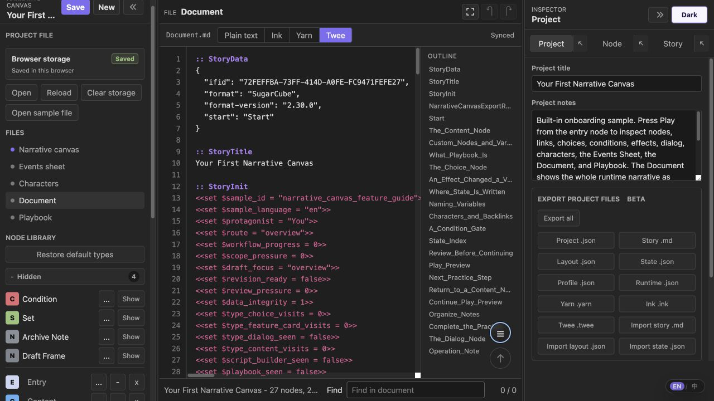
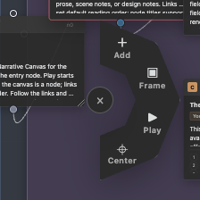

# Narrative Canvas 1.2.0

Compared with GitHub release `1.1.2`.

## English

### Added

- **`Document.md`** — a new file for editing the project's runtime narrative as Plain text, Ink, Yarn, or Twee. Recognized nodes, choices, conditions, effects, routes, and variables sync back to the project incrementally, while canvas layout and unsupported metadata are preserved. It sits directly above `Playbook.json`.
- The `Document.md` editor is a full-page, VSCode-style code editor: format-aware syntax highlighting, a line-number gutter, Tab / Shift+Tab indentation, an inline find bar (Enter cycles matches with a match count), and a collapsible outline built from the document's headings. Twee mode shows editable Twee 3 / SugarCube `StoryData`, `StoryInit`, and passages with stable node IDs for incremental project sync.

  

- **Frame Canvas** — open any frame as a focused editing canvas from the frame header, Story row, inspector, or node context menu.
- **Radial quick menu** — right-clicking blank canvas (or a frame body) opens a four-segment half-ring at the cursor for Add, Frame, Play, and Center; Add opens a Node Library picker at that spot.

  

- **Immersive fullscreen** — a toggle next to Undo/Redo expands the complete app: both sidebars, the inspector, workspace tabs, status bar, and an open Play panel.
- **Inspector center-window** — controls beside the Project, Node, and Story tabs open each panel as a wider centered window.
- **Float / dock the Play preview** — a button in the preview header lifts the docked preview into a centered floating window and docks it back to the right.
- Choice cards list configured options line by line, and Dialog cards show a clipped preview of authored turns. Back-to-top is now available on all four workspace tabs (Events Sheet, Characters, Playbook, Document).

### Fixed

- **Right-click menus** — a node or frame header (including its top border, where the input port overlaps) opens the vertical layer menu with z-order controls and delete; a frame body or blank canvas opens the radial quick menu. These menus now also appear in immersive fullscreen and open reliably even when the SVG link layer receives the event. Deleting a frame reparents its children to the next surviving frame or the canvas root.
- **Play mode** — the inspector stays on the current Node and recalculates the focused node's content, choice availability, and route as you edit it (without replaying visit effects); a right panel you collapse during Play stays collapsed; and Play actions sit below the content/debug section with each option on its own full-width row.
- **Dialog turns** no longer disappear while editing — empty in-progress turns (and choice options with a cleared label) survive saves and reloads, and committing an edit no longer resets the inspector scroll or eats the click, so "Add turn" works in one click even in long lists.
- **Frame Canvas** keeps dragged or resized child nodes visually contained by expanding the active and nested frames as needed, including left and top movement.
- **Marquee select** keeps the multi-selection when the pointer is released over a node.
- **Exports** (Project, Story, Layout, State, Profile, Runtime, Yarn, Ink, Twee) no longer intermittently cancel or produce empty files in the Obsidian/Electron runtime.
- **Document round-trip safety** now compares edited source with a freshly generated baseline and writes back only changed fields. Stable node-title metadata and body boundaries protect templates and script-like prose; project notes, complex variables, typed Ink lists, portable conditions, supported effects, and existing routes round-trip without overwriting runtime-only data.
- **Document structure validation** rejects missing or duplicated node IDs, incomplete body markers, and accidental node/choice/route count changes while source is being edited. Structural additions and deletions remain in the canvas or inspector.
- **Onboarding sample** descriptions now match the four-format Document editor and automatic Choice numbering. Chinese copy consistently uses the UI term `演示设置`.
- **Post-drag clicks** are suppressed only for the drag-release event, so a later intentional click can expand a frame or activate another canvas control.

### Issue response

- This release addresses the reported Frame Canvas and editing workflow gaps. Thanks to the issue reporter [LuYifeng112](https://github.com/ringeringeraja33/NarrativeCanvas/issues?q=is%3Aissue%20state%3Aopen%20author%3ALuYifeng112) for the detailed feedback and reproduction notes.

## 中文

### 新增

- **`Document.md`** —— 新增文件，可将项目运行时叙事切换为纯文本、Ink、Yarn 或 Twee 直接编辑。可识别的节点、选项、条件、效果、跳转和变量会增量写回项目，画布布局及格式无法表达的元数据保持不变。它位于 `Playbook.json` 上方。
- `Document.md` 编辑器是整页的、与 VSCode 原生编辑区手感一致的代码编辑器：按格式区分的语法高亮、行号栏、Tab / Shift+Tab 缩进、行内查找栏（回车循环切换并显示匹配计数），以及由文档标题生成的可折叠目录。Twee 模式会显示可编辑的 Twee 3 / SugarCube `StoryData`、`StoryInit` 和 passage，并通过稳定节点 ID 增量同步回项目。
- **框架画布** —— 可从框架标题栏、Story 行、检查器或节点右键菜单，将某个框架作为聚焦编辑画布打开。
- **环形快捷菜单** —— 右键空白画布（或框架内部空白处）会在光标处弹出四段半环，包含 Add、Frame、Play、Center；Add 可在该处展开节点库选择器。
- **沉浸式全屏** —— 撤销/重做旁的按钮可展开完整应用：左右侧栏、检查器、工作区页签、状态栏和已打开的 Play 面板。
- **检查器居中浮窗** —— Project、Node、Story 页签旁的按钮可将对应面板作为更宽的居中浮窗打开。
- **Play 演示浮动/停靠** —— 演示头部的按钮可将停靠的演示窗抬升为居中浮窗，并可停靠回右侧。
- Choice 卡片逐行显示已配置选项，Dialog 卡片显示对话轮次的裁剪预览。回顶部按钮现已在全部四个工作区页签（事件表、角色、演示设置、文档）可用。

### 修复

- **右键菜单** —— 节点或框架的标题栏（含被输入端口盖住的顶部边框）右键弹出竖式层级菜单（层级操作与删除）；框架内部空白处或空白画布则弹出环形快捷菜单。这些菜单现在也能在沉浸式全屏下呼出，且即使 SVG 连线层接收到事件也能可靠弹出。删除框架时，内部节点会安全提升到仍存在的上级框架或画布根层级。
- **Play 演示** —— 检查器始终停在当前 Node 页签，并在编辑当前节点时立即重算其显示内容、选项可用性和后续路线（不重复执行进入节点效果）；演示期间被手动折叠的右侧面板保持折叠；Play 按钮位于正文/调试栏下方，且每个选项单独占一整行。
- **对话轮次** 编辑时不再"消失" —— 编辑中的空轮次（以及标签被清空的 Choice 选项）会在保存和重新载入后保留，提交修改也不再重置检查器滚动或吞掉点击，因此轮次很多时"添加轮次"也能一次点击生效。
- **框架画布** 拖动或调整内部节点后，会按需扩展当前框架和嵌套框架（含左移、上移），保持节点被框架视觉包围。
- **选框多选** 即使鼠标在某个节点内部松开，也会保持多选。
- **各项导出**（项目、剧情、布局、状态、格式档案、运行数据、Yarn、Ink、Twee）不再在 Obsidian/Electron 运行环境下偶发被取消或生成空文件。
- **Document 双向解析安全性** —— 写回前先用当前项目生成基线，只更新真正变化的字段。稳定节点标题元数据和正文边界可保护模板及类似脚本的正文；项目备注、复杂变量、Ink 类型化列表、目标格式条件、受支持效果和现有路线均可安全往返，不再覆盖仅运行时数据。
- **Document 结构校验** —— 编辑过程中若节点 ID 缺失或重复、正文边界不完整，或节点/选项/路线数量意外变化，源文件会进入错误状态且不修改项目；结构增删继续在画布或检查器中完成。
- **上手示例** 已对齐四格式 Document 编辑器和 Choice 自动编号；中文内容统一使用界面名称“演示设置”。
- **拖动后的点击** 只拦截拖动释放产生的尾随事件，后续主动点击可正常展开框架或操作其他画布控件。

### Issue 处理

- 本版本集中处理 issue 中提出的框架画布与编辑工作流问题，感谢 issue 提出者 [LuYifeng112](https://github.com/ringeringeraja33/NarrativeCanvas/issues?q=is%3Aissue%20state%3Aopen%20author%3ALuYifeng112) 提供细致反馈和复现说明。
